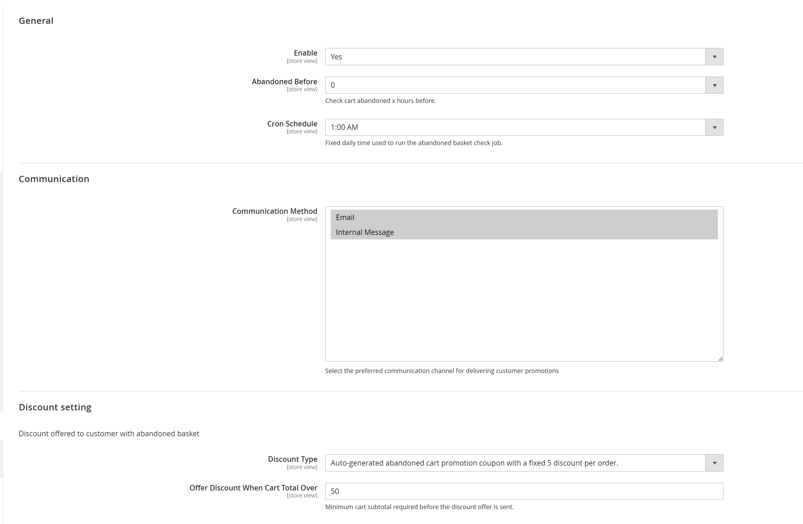
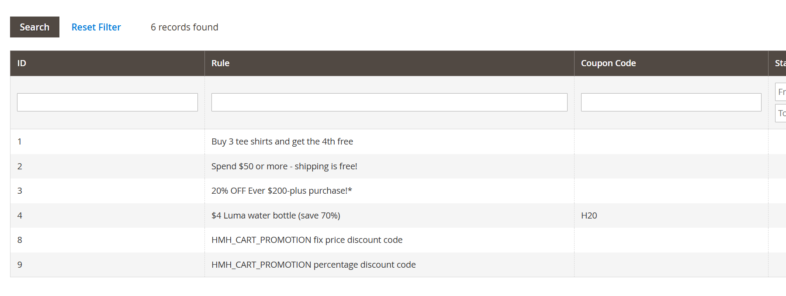
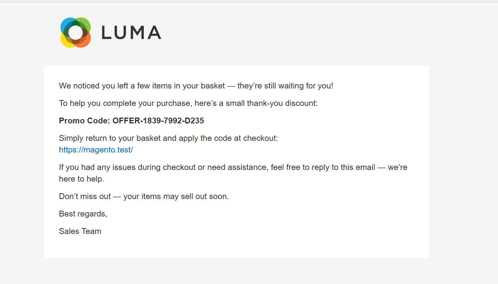
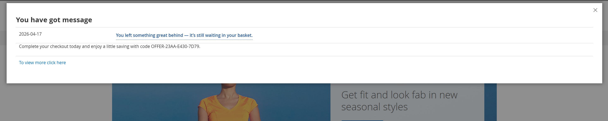

# Hmh_AbandonCartPromotion

Magento 2 module for finding customer quotes that may have been left behind, generating one-time sales-rule coupons, and notifying customers through internal message and/or transactional email.

## Features

- Admin configuration for:
  - enabling the module
  - choosing how many hours old a quote must be before it is considered
  - selecting the daily cron execution time
  - selecting notification methods
  - selecting the sales rule used for generated coupons
- Cron job that scans eligible customer quotes
- Message queue topic and consumer for async promotion processing
- One-time coupon generation with `OFFER-xxxx-xxxx-xxxx` format
- Notification strategy dispatch based on configured methods:
  - `internal_message`
  - `email`
- Magento CLI command to trigger the processor manually

## Configuration

Admin path:

- `Stores > Configuration > HMH > Abandon Cart Promotion`

Config paths:

- `hmh_abandoncartpromotion/general/enabled`
- `hmh_abandoncartpromotion/general/abandoned_before`
- `hmh_abandoncartpromotion/general/cron_schedule`
- `hmh_abandoncartpromotion/communication/method`
- `hmh_abandoncartpromotion/discount/type`

## Queue

Run the consumer:

```bash
bin/magento queue:consumers:start hmh.abandon.cart.promo.consumer
```

Example with a message limit:

```bash
bin/magento queue:consumers:start hmh.abandon.cart.promo.consumer --max-messages=100
```

## Console Command

Run the processor without waiting for cron:

```bash
bin/magento hmh:abandon-cart:process
```

## Email Template

Registered template id:

- `hmh_abandon_cart_promo_email_template`

Template file:

- `view/frontend/email/abandon_cart_promo.html`

## Screenshots

### Module Configuration

Administrative configuration for enabling the module, defining the cart subtotal threshold, selecting notification channels, and scheduling the daily processing job.



### Cart Price Rule

Default cart price rules created for the module. Additional eligible promotion rules can be added by creating new cart price rules with names that begin with `HMH_CART_PROMOTION`.



### Email

Transactional email preview showing the default header and footer, promotional messaging, and generated coupon code presentation.



### Internal Message

Internal message example as delivered through the configured notification channel, including the promotional copy and coupon code.



## Dependencies

- `Magento_Customer`
- `Magento_Email`
- `Magento_SalesRule`
- `Hmh_Core`
- `Hmh_InternalMessage`

## Development Notes

- Customer-facing copy is translated through `i18n/en_US.csv`
- Notification delivery uses strategy classes under `Model/Notification/Strategy`
- Coupon creation is isolated in `Model/Coupon/CouponCodeGenerator`
- Queue messages are JSON payloads containing quote/customer/store data

## Useful Commands

```bash
bin/magento hmh:abandon-cart:process
bin/magento queue:consumers:start hmh.abandon.cart.promo.consumer
```
